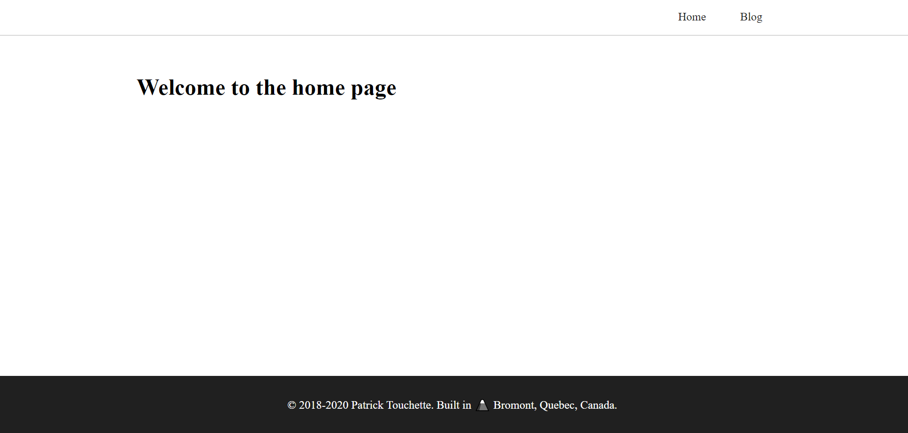
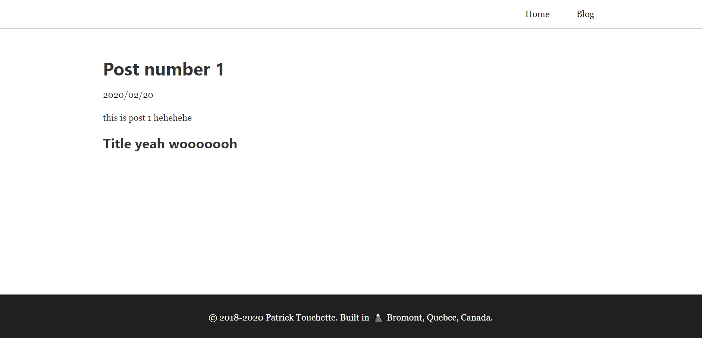
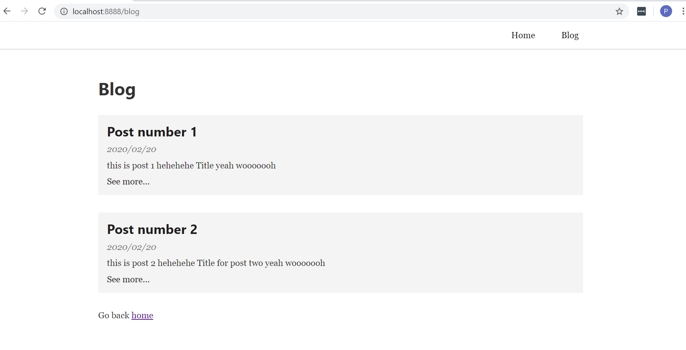

## What we will be doing

We will be building a blog website with gatsbyjs, react and markdown files.

The blog will contain the following features:

> Posts are written in markdown files  
> Typography  
> Fluid image loading  
> Code syntax hightlighting with prismjs  
> SCSS for styling

## What you should know

Basics of javascript, react and css/scss. Markdown syntax to write blog posts.

## Install the gastby CLI

```bash
npm install -g gatsby-cli
```

## Install the basic gatsby starter

```bash
npx gatsby new myBlog
```

Check if everything is working.
The server should start gatsby in dev mode.

```bash
npm run develop
```

If you already have something running on port 8000, you can specify a port by modifying the develop script in your package.json file. While in the package.json file you may as well go ahead and change the name, description, author, etc...

```json
...
  "scripts": {
    "build": "gatsby build",
    "develop": "gatsby develop -p 8888",
...
```

Finally, we want to start with a completely blank project.
Remove everything from src as well as the gatsby config-files

```bash
rm -rv src
rm gatsby-ssr.js gatsby-node.js gatsby-config.js gatsby-browser.js
```

Create the folder structure and blank config files

```bash
mkdir src src/components src/images src/pages src/templates
touch gatsby-node.js gatsby-config.js gatsby-browser.js
```

Configure the sharp plugins else your gatsby will crash.

<div class="filename">gatsby-config.js</div>

```js
module.exports = {
  plugins: [`gatsby-transformer-sharp`, `gatsby-plugin-sharp`],
}
```

Make sure everything works. Start the dev server.

```bash
npm run develop
```

## Creating the home page

```bash
touch src/pages/index.js
```

<div class="filename">index.js</div>

```js
import React from "react"

const Index = () => {
  return (
    <div>
      <h1>Welcome to the home page</h1>
    </div>
  )
}

export default Index
```

Now go to localhost:8000 (or whatever you set it up to). You should see your home page.

## Installing Sass for styling

We will be using SCSS to style our pages and components.

```bash
npm install --save node-sass gatsby-plugin-sass
```

Add sass to your `gatsby-config.js` file.

<div class="filename">gastby-config.js</div>

```js
module.exports = {
  plugins: [
    `gatsby-transformer-sharp`,
    `gatsby-plugin-sharp`,
    `gatsby-plugin-sass`,
  ],
}
```

## Creating our website layout

In this section we will create the following components

Create the following files in `src/components`

- container.js
- container.scss
- header.js
- header.scss
- footer.js
- footer.scss
- layout.js
- layout.scss

<div class="filename">container.js</div>

```js
import React from "react"
import "./container.scss"

const Container = ({ children }) => {
  return <div className="container">{children}</div>
}

export default Container
```

<div class="filename">container.scss</div>

```css
.container {
  max-width: 950px;
  margin: 0 auto;
  padding: 2rem;
  width: 100%;
}
```

<div class="filename">header.js</div>

```js
import React from "react"
import { Link } from "gatsby"
import Container from "./container"
import "./header.scss"

const Header = () => {
  return (
    <header className="header">
      <Container>
        <nav>
          <ul>
            <li>
              <Link to="/">Home</Link>
            </li>
            <li>
              <Link to="/blog">Blog</Link>
            </li>
          </ul>
        </nav>
      </Container>
    </header>
  )
}

export default Header
```

<div class="filename">header.scss</div>

```scss
.header {
  border-bottom: 1px solid rgba(0, 0, 0, 0.2);

  .container {
    padding: 0;
  }

  nav ul {
    display: flex;
    flex-direction: row;
    flex-wrap: wrap;
    list-style: none;
    padding: 0;
    margin: 0;

    justify-content: flex-end;
    align-items: center;
  }

  ul li {
    margin-right: 2rem;
    padding: 1rem 0;
  }

  ul a {
    text-decoration: none;
    color: #202020;
    padding: 0.5rem;
    cursor: pointer;
    border-bottom: 2px solid transparent;
    transition: border-bottom 0.3s ease-in-out;
  }

  ul a:hover {
    border-bottom: 2px solid blue;
  }
}
```

<div class="filename">footer.js</div>

```js
import React from "react"
import Container from "./container"
import "./footer.scss"

const Footer = () => {
  return (
    <footer className="footer">
      <Container>
        <p>
          © 2018-2020 Patrick Touchette. Built in{" "}
          <span role="img" aria-label="mountain">
            🗻
          </span>{" "}
          Bromont, Quebec, Canada.
        </p>
      </Container>
    </footer>
  )
}

export default Footer
```

<div class="filename">footer.scss</div>

```scss
.footer {
  text-align: center;
  background: #202020;
  color: white;
}
```

<div class="filename">layout.js</div>

```js
import React from "react"
import Header from "./header"
import Container from "./container"
import Footer from "./footer"
import "./layout.scss"

const Layout = ({ children }) => {
  return (
    <div className="layout">
      <Header />
      <Container>{children}</Container>
      <Footer />
    </div>
  )
}

export default Layout
```

<div class="filename">layout.scss</div>

```scss
.layout {
  display: flex;
  flex-direction: column;
  min-height: 100vh;
  justify-content: flex-start;

  .footer {
    margin-top: auto;
    justify-self: flex-end;
  }
}
```

Ok now that that is out of the way lets build our home and blog pages.

## Creating Home page and blog page

Lets update the index pages to use our newly created Layout component.

<div class="filename">src/pages/index.js</div>

```js
import React from "react"
import Layout from "../components/layout"

const Index = () => {
  return (
    <Layout>
      <h1>Welcome to the home page</h1>
    </Layout>
  )
}

export default Index
```

Finally lets create the blog page wich will contain the list of blog posts.

<div class="filename">src/pages/blog.js</div>

```js
import React from "react"
import Layout from "../components/layout"

const Blog = () => {
  return (
    <Layout>
      <h1>Blog page</h1>
    </Layout>
  )
}

export default Blog
```

You should now have a page that looks like this.



## Installing Gatsby Plugins

We will be sourcing our posts from markdown files. There is a list of plugins we should install and configure to get all of this to work.
Some of these may already be installed from the gatsby starter.

Most notably we will have syntax highlighting for code with prismjs, typography from gatsy-plugin-typography and posts data with the gatsby-transformer-remark.
Make sure all of the plugins are installed.

- `gatsby-source-filesystem`
- `gatsby-plugin-sharp`
- `gatsby-transformer-remark`
- `gatsby-remark-images`
- `gatsby-remark-relative-images`
- `gatsby-remark-prismjs`
- `prismjs`
- `gatsby-plugin-typography`
- `react-typography`
- `typography`

```bash
npm install --save gatsby-source-filesystem gatsby-plugin-sharp
npm install --save gatsby-transformer-remark
npm install --save gatsby-remark-images gatsby-remark-relative-images
```

## Configuring the Typography plugin

Start by installing these packages.

```bash
npm install --save gatsby-plugin-typography react-typography typography
```

To get typography to work, you can set it all up yourself of rather use one of the many preconfigured themes.

Check out the themes here https://kyleamathews.github.io/typography.js/

I will be using the default theme.

Create a typography file in `src/styles`

```bash
touch src/styles/typography.js
```

<div class="filename">typography.js</div>

```js
import Typography from "typography"

const typography = new Typography()

// Export helper functions
export const { scale, rhythm, options } = typography
export default typography
```

and we need to configure the typography plugin inside gastby-config.js.

<div class="filename">gatsby-config.js</div>

```js
module.exports = {
  plugins: [
    `gatsby-transformer-sharp`,
    `gatsby-plugin-sharp`,
    `gatsby-plugin-sass`,
    {
      resolve: `gatsby-plugin-typography`,
      options: {
        pathToConfigModule: `src/styles/typography`,
      },
    },
  ],
}
```

Stop the server and restart it server with `npm run develop`
You should see that the typography has been applied. Since it applies margin-bottom to `<p>` and `<li>` elements you may want to go back to the header.scss and footer.scss files to add a `margin-bottom: 0` to those elements.

## Configuring the posts with the remark plugin

First lets create some posts. We will keep our posts in a folder called blog.

```bash
mkdir blog blog/post1 blog/post2
touch blog/post1/post1.md blog/post2/post2.md
```

Create two posts with the following content

<div class="filename">blog/post1/post1.md</div>

```md
---
title: "Post number 1"
date: "2020/02/20"
slug: "post1"
---

this is post 1 hehehehe

## Title yeah wooooooh
```

<div class="filename">blog/post2/post2.md</div>

```md
---
title: "Post number 2"
date: "2020/02/20"
slug: "post2"
---

this is post 2 hehehehe

## Title for post two yeah wooooooh
```

Let's create the blog template. This is a component that will be used at build time to generate a new page for each post.

```bash
touch src/templates/blog-post.js
```

<div class="filename">src/templates/blog-post.js</div>

```js
import React from "react"
import Layout from "../components/layout"
import { graphql } from "gatsby"

const BlogPost = ({ data }) => {
  const { frontmatter, html } = data.markdownRemark
  return (
    <Layout>
      <h1>{frontmatter.title}</h1>
      <p>{frontmatter.date}</p>
      <div dangerouslySetInnerHTML={{ __html: html }}></div>
    </Layout>
  )
}

export default BlogPost

export const query = graphql`
  query($slug: String) {
    markdownRemark(fields: { slug: { eq: $slug } }) {
      frontmatter {
        title
        date
      }
      html
      fields {
        slug
      }
    }
  }
`
```

Then we should configure the remark plugins inside the gastby-config-file. Make sure to install these plugins if you have not already.

```bash
npm install --save gatsby-source-filesystem
npm install --save gatsby-plugin-sharp
npm install --save gatsby-transformer-remark
npm install --save gatsby-remark-images
npm install --save gatsby-remark-relative-images
```

<div class="filename">gatsby-config.js</div>

```js
module.exports = {
  plugins: [
    `gatsby-transformer-sharp`,
    `gatsby-plugin-sharp`,
    `gatsby-plugin-sass`,
    {
      resolve: `gatsby-plugin-typography`,
      options: {
        pathToConfigModule: `src/styles/typography`,
      },
    },
    {
      resolve: "gatsby-source-filesystem",
      options: {
        name: "blog",
        path: `${__dirname}/blog/`,
      },
    },
    {
      resolve: `gatsby-transformer-remark`,
      options: {
        plugins: [
          "gatsby-remark-relative-images",
          {
            resolve: "gatsby-remark-images",
            options: {
              maxWidth: 750,
              linkImagesToOriginal: false,
            },
          },
        ],
      },
    },
  ],
}
```

Up next we will configure the `gatsby-node.js` file.

<div class="filename">gatsby-node.js</div>

```js
const path = require("path")

module.exports.onCreateNode = ({ node, actions }) => {
  const { createNodeField } = actions

  if (node.internal.type === "MarkdownRemark") {
    // console.log("node", JSON.stringify(node, undefined, 4))

    const slug = node.frontmatter.slug
    console.log("slug", slug)

    createNodeField({
      node,
      name: "slug",
      value: slug,
    })
  }
}

module.exports.createPages = async ({ graphql, actions }) => {
  const { createPage } = actions

  // MARKDOWN BLOG
  const blogTemplate = path.resolve("./src/templates/blog-post.js")
  const res = await graphql(`
    query {
      allMarkdownRemark {
        edges {
          node {
            fields {
              slug
            }
          }
        }
      }
    }
  `)

  res.data.allMarkdownRemark.edges.forEach(edge => {
    createPage({
      component: blogTemplate,
      path: `/blog/${edge.node.fields.slug}`,
      context: {
        slug: edge.node.fields.slug,
      },
    })
  })
}
```

`npm run develop` should now generate the blog posts

You can visit it at `localhost:8888/blog/post1



## Creating the blog posts page

Edit the `src/pages/blog.js` file

<div class="filename">src/pages/blog.js</div>

```js
import React from "react"
import { Link, useStaticQuery, graphql } from "gatsby"
import Layout from "../components/layout"
import "./blog.scss"

const BlogPage = () => {
  const data = useStaticQuery(graphql`
    query {
      allMarkdownRemark {
        edges {
          node {
            frontmatter {
              title
              date
            }
            excerpt
            html
            fields {
              slug
            }
          }
        }
      }
    }
  `)

  const { edges } = data.allMarkdownRemark

  const posts = edges.map(edge => {
    const { frontmatter, excerpt, fields } = edge.node
    return (
      <li key={frontmatter.title} className="post">
        <Link to={`/blog/${fields.slug}`}>
          <h2>{frontmatter.title}</h2>
        </Link>
        <p className="date">{frontmatter.date}</p>
        <p>{excerpt}</p>
        <Link to={`/blog/${fields.slug}`}>See more...</Link>
      </li>
    )
  })

  return (
    <div className="blog-page">
      <Layout>
        <h1>Blog</h1>
        <ul>{posts}</ul>
        <p>
          Go back <Link to="/">home</Link>
        </p>
      </Layout>
    </div>
  )
}

export default BlogPage
```

create the blog.scss file for the styling of the blog page

```bash
touch src/pages/blog.scss
```

<div class="filename">src/pages/blog.scss</div>

```css
.blog-page {
  ul {
    list-style: none;
    margin: 0;
  }

  .post {
    margin: 2rem 0rem;
    padding: 1rem;
    background: #f4f4f4;

    a {
      color: #202020;
      text-decoration: none;
      display: block;
    }

    a:hover {
      color: blue;
    }

    h2 {
      margin-bottom: 0.7rem;
    }

    .date {
      color: #777777;
      font-size: 0.8;
      font-style: italic;
    }
  }
}
```

This is what the blog page should look like



## Configuring Primsjs syntax highlighting

finally we want to add syntax highlighting for code blocks.

Install the primsjs and gatsby-remark-prismjs plugin

```bash
npm install --save gatsby-remark-prismjs prismjs
```

<div class="filename">gatsby-config</div>

```js
module.exports = {
  plugins: [
    `gatsby-transformer-sharp`,
    `gatsby-plugin-sharp`,
    `gatsby-plugin-sass`,
    {
      resolve: `gatsby-plugin-typography`,
      options: {
        pathToConfigModule: `src/styles/typography`,
      },
    },
    {
      resolve: "gatsby-source-filesystem",
      options: {
        name: "blog",
        path: `${__dirname}/blog/`,
      },
    },
    {
      resolve: `gatsby-transformer-remark`,
      options: {
        plugins: [
          "gatsby-remark-relative-images",
          {
            resolve: "gatsby-remark-images",
            options: {
              maxWidth: 750,
              linkImagesToOriginal: false,
            },
          },
          {
            resolve: `gatsby-remark-prismjs`,
          },
        ],
      },
    },
  ],
}
```

To actually get the css style, choose a theme and require it in `gatsby-browser.js`

<div class="filename">gatsby-browser</div>

```js
require("prismjs/themes/prism-tomorrow.css")
```

We can overide the css from prism by require an additional css file after we required the prism theme.
Here is what my final `gastby-browser` looks like.

<div class="filename">src/styles/prism-override.css</div>

```css
.filename {
  background: #202020;
  color: yellow;
  font-style: italic;
  padding: 0.5rem;
}

pre[class*="language-"] {
  margin: 0;
  margin-bottom: 1.45rem;
}
```

I also added some normalize and reset css to my `gatsby-browser` file. Here is what the final file looks like.

<div class="filename">gatsby-browser</div>

```js
import "./src/styles/normalize.css"
import "./src/styles/reset.css"
require("prismjs/themes/prism-tomorrow.css")
require("./src/styles/prism-override.css")
```

## What's left ?

There are still many things we could add to improve our blog. We could configure SEO, create a tag and category system for the posts, add some styling, pages, and much much more...

## References

https://www.gatsbyjs.org/docs/quick-start

https://kyleamathews.github.io/typography.js/

https://www.gatsbyjs.org/packages/gatsby-plugin-typography/

https://www.gatsbyjs.org/packages/gatsby-remark-prismjs/
